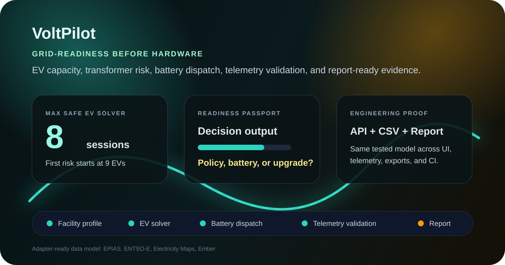
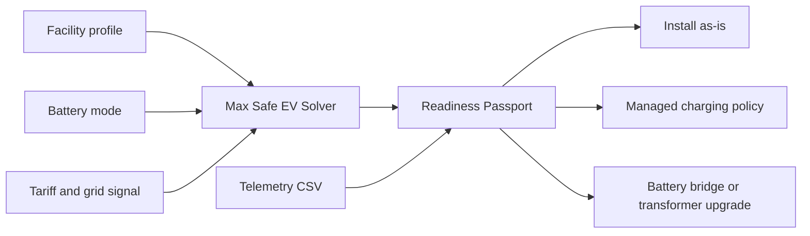
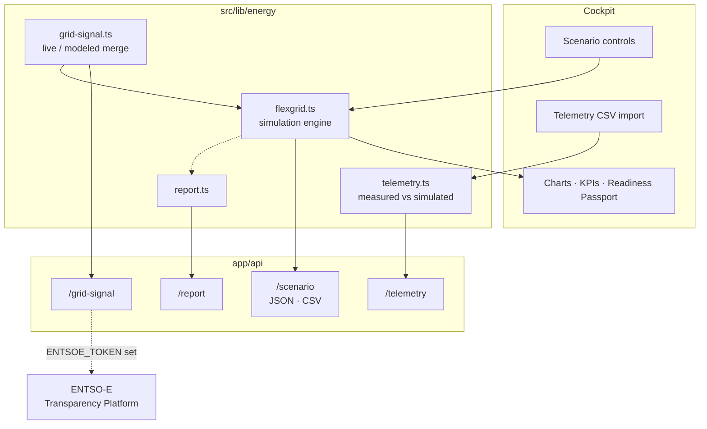

# VoltPilot

[](https://github.com/emrefbulut/VoltPilot/actions/workflows/ci.yml)


Pre-hardware grid-readiness cockpit for EV charging, transformer loading, battery dispatch, virtual grid signals, telemetry validation, and engineering report generation.



VoltPilot is a software-first electrical and electronics engineering portfolio project. It helps a facility answer a practical question before buying chargers, meters, batteries, or transformer upgrades:

> How many EV charging sessions can this site support safely, where does electrical risk begin, and what is the next engineering action?

The app runs without physical hardware, models small-facility scenarios, simulates flexible-load orchestration, estimates transformer loading, solves the maximum safe EV concurrency before hardware purchase, and validates simulated dispatch against mock or measured telemetry samples.

## The problem

Most energy tools monitor installed hardware or optimise chargers already in the
ground. VoltPilot addresses the decision that comes *before* the purchase order:

> How many EV charging sessions can this facility support safely, where does
> transformer risk begin, and should the next move be a charging policy, a
> battery bridge, or a transformer upgrade?

The answer is packaged as a **Readiness Passport**:

| Output | What it answers |
| :--- | :--- |
| **Max Safe EV Solver** | Largest EV concurrency that stays inside transformer kVA and overload limits |
| **First-risk threshold** | The EV count at which the site leaves the safe envelope |
| **Storage bridge estimate** | Battery energy needed to hold the requested plan inside the managed stress band |
| **Transformer upgrade target** | Next standard kVA rating when the plan exceeds the envelope |
| **Control-mode envelope** | Uncontrolled, tariff-aware, orchestrated, and optimizer strategies on the same facility |

The UI, JSON, CSV, and Markdown report all read from the same tested scenario
model, so an exported figure and an on-screen figure cannot drift apart.



## Architecture



The engine is a pure module with no React or network dependency, which is what
lets the same code back the UI, four API routes, and the test suite.

## Capabilities

| Area | What is implemented |
| :--- | :--- |
| **Facility profiles** | Apartment blocks, workshops, cafes, electronics labs |
| **Scenario controls** | EV concurrency, tariff plan, control strategy, storage mode, analysis horizon, presets |
| **Horizons** | 24-hour or 7-day load profile with uncontrolled baseline and transformer limit overlay |
| **Electrical outputs** | kW, kVA, estimated current, power factor, overload hours, battery SoC |
| **Economics** | Tariff-aware cost, carbon, and engineering-confidence indicators |
| **Readiness Passport** | Max safe EV sessions, first-risk threshold, storage bridge, transformer upgrade target |
| **Strategy comparison** | Uncontrolled, tariff-aware, orchestrated, constraint-optimized |
| **Optimizer** | Peak shaving, tariff exposure, battery SoC, transformer headroom |
| **Grid data** | `/api/grid-signal` with a working ENTSO-E adapter and per-field `fieldSources` |
| **Telemetry** | CSV import with template download, measured-vs-simulated comparison via `/api/telemetry` |
| **Exports** | JSON, CSV, and a downloadable Markdown engineering report |
| **Sharing** | URL-encoded scenarios and browser-local saved scenarios |
| **Verification** | Vitest suite over engine, telemetry, CSV, grid signal, and API routes; CI on every push |

## Demo Flow

1. Select a facility profile, EV count, tariff plan, battery mode, and control strategy.
2. Check the Readiness Passport for max safe EV sessions, first-risk threshold, storage bridge, and transformer upgrade recommendation.
3. Compare uncontrolled, tariff-aware, orchestrated, and optimizer strategies.
4. Import telemetry CSV or use mock telemetry to compare measured-vs-simulated behavior.
5. Export JSON, CSV, or a Markdown engineering report for documentation.

## Data Sources

VoltPilot runs on modeled data by default and upgrades individual fields to
measured data when a provider adapter and its credential are both available.

**Implemented — ENTSO-E Transparency Platform.** Set `ENTSOE_TOKEN` and request
`/api/grid-signal?provider=entsoe`. The adapter fetches two series for the
selected Turkish market day and merges them onto the 24-hour signal:

| Field | Source with `ENTSOE_TOKEN` set |
| :--- | :--- |
| `loadMw` | measured — ENTSO-E A65, system total load (realised) |
| `marketPriceTlMwh` | measured — ENTSO-E A44, day-ahead prices |
| `renewableSharePct` | modeled — not published as a single series |
| `carbonIntensityGco2Kwh` | modeled — not published as a single series |

Every response carries a `fieldSources` object stating which of the four fields
was measured and which stayed modeled, so a "live" response never implies more
than it delivers. Hours the platform has not published yet keep their modeled
value, and any upstream failure returns the modeled signal with
`status: "fallback"` plus the reason — the endpoint contract holds either way.

**Documented targets, not implemented.** EPIAS, Electricity Maps and Ember appear
in the provider list with their credential names, cadence and granularity, but
have no adapter yet; selecting them returns modeled data. Their
`adapterStatus` is `"source"`, while ENTSO-E is `"live"`.

Without any credential the app generates deterministic 24-hour data for Turkey,
so every run is reproducible and the tests never touch the network.

Sources: [EPIAS technical documentation](https://seffaflik-prp.epias.com.tr/electricity-service/technical/tr/index.html), [ENTSO-E Transparency Platform](https://transparency.entsoe.eu/), [Electricity Maps API](https://portal.electricitymaps.com/docs/api), [Ember API](https://ember-energy.org/data/api/).

## Data Refresh Notes

The default grid signal is deterministic data generated for the requested date, so every run is reproducible and CI-safe. The ENTSO-E adapter fetches on request with a 10-second timeout and no caching layer; add one before pointing a dashboard at it with a short poll interval.

For the adapters that are still documented targets, refresh behavior should be provider- and dataset-specific:

- EPIAS: Official Turkish market and transparency datasets are published through EPIAS services; refresh cadence depends on the selected dataset and market process.
- ENTSO-E: Transparency Platform data is exposed through multiple channels, including REST API and file/subscription workflows; publication timing and resolution depend on the data item.
- Electricity Maps: API endpoints default to hourly temporal granularity and can support 5-minute, 15-minute, hourly, and aggregated historical granularities where available.
- Ember: Monthly Electricity Data is updated twice per month, with releases in the first and third weeks of the month.

## Tech Stack

- Next.js App Router
- TypeScript
- Tailwind CSS
- Recharts
- Vitest
- Scenario simulation engine
- Virtual grid signal API
- Stateless telemetry comparison API
- CSV and JSON exports

## Quick Start

```bash
pnpm install
pnpm dev
```

Open `http://localhost:3000`.

## Quality Commands

```bash
pnpm test
pnpm typecheck
pnpm lint
pnpm build
pnpm check
```

## API Examples

Scenario JSON:

```text
/api/scenario?siteType=workshop&strategy=orchestrated&batteryMode=small&tariffPlan=tou&evCount=4
```

Readiness Passport stress case:

```text
/api/scenario?siteType=apartment&strategy=baseline&batteryMode=none&tariffPlan=critical&evCount=24&analysisDays=7
```

7-day optimizer scenario:

```text
/api/scenario?siteType=workshop&strategy=optimizer&batteryMode=medium&tariffPlan=critical&evCount=8&analysisDays=7
```

Scenario JSON with grid signal:

```text
/api/scenario?siteType=workshop&strategy=orchestrated&batteryMode=small&tariffPlan=tou&evCount=4&gridProvider=epias&gridDate=2026-05-06
```

Scenario CSV:

```text
/api/scenario?siteType=workshop&strategy=orchestrated&batteryMode=small&tariffPlan=tou&evCount=4&format=csv
```

Virtual grid signal:

```text
/api/grid-signal?provider=demo&date=2026-05-06
```

Telemetry comparison:

```bash
curl -X POST http://localhost:3000/api/telemetry \
  -H "Content-Type: application/json" \
  -d '{
    "mode": "mock",
    "scenario": {
      "siteType": "workshop",
      "strategy": "orchestrated",
      "batteryMode": "small",
      "tariffPlan": "tou",
      "evCount": 4
    }
  }'
```

Engineering report:

```text
/api/report?siteType=workshop&strategy=optimizer&batteryMode=medium&tariffPlan=critical&evCount=8&analysisDays=7&gridProvider=epias&gridDate=2026-05-06
```

## Environment Variables

The app runs fully without any of these. Only `ENTSOE_TOKEN` currently changes
behaviour — the other three are documented adapter targets with no implementation
yet, and setting them has no effect today.

```env
# Implemented. With this set, /api/grid-signal?provider=entsoe returns measured
# system load and day-ahead price. Free registration at transparency.entsoe.eu.
ENTSOE_TOKEN=

# Documented targets, not implemented.
EPIAS_TGT=
ELECTRICITY_MAPS_TOKEN=
EMBER_API_KEY=
```

## Repository Structure

- `app/api/scenario/route.ts` - scenario JSON and CSV export
- `app/api/grid-signal/route.ts` - virtual grid signal endpoint
- `app/api/telemetry/route.ts` - telemetry validation and comparison
- `app/api/report/route.ts` - Markdown engineering report export
- `components/energy` - cockpit UI and dashboard panels
- `src/lib/energy/flexgrid.ts` - simulation engine
- `src/lib/energy/grid-signal.ts` - grid signal core and live/modeled merge
- `src/lib/energy/providers/entsoe.ts` - ENTSO-E Transparency Platform adapter
- `src/lib/energy/telemetry.ts` - measured-vs-simulated comparison core
- `src/lib/energy/report.ts` - report generation core
- `tests` - model, telemetry, CSV, grid signal, and API tests
- `docs` - architecture, telemetry, validation, API, virtual-data, and roadmap notes
- `docs/LINKEDIN_POST.md` - LinkedIn launch copy and visual notes

## License

MIT. Copyright (c) 2026 Emre Bulut.
